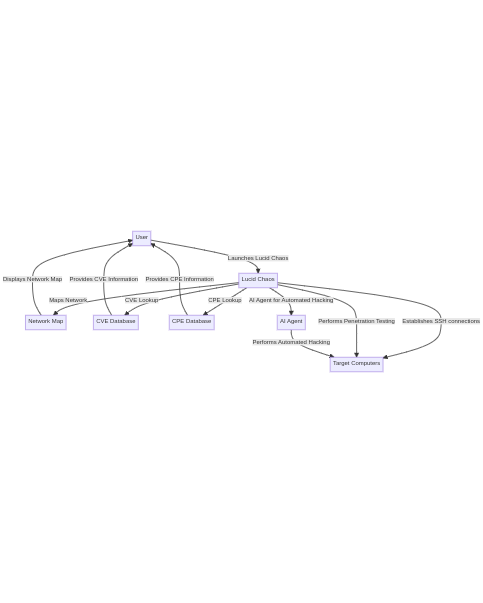
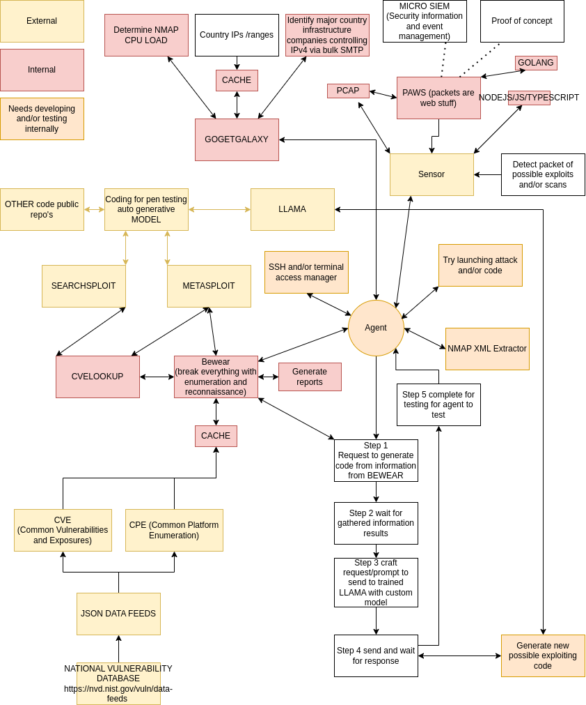

# lucidchaos
LUCID CHAOS: Leveraging Unseen Cyber Intrusion Dynamics - Comprehensive Hacking and Offensive Operations System

# User overview

# Design overview

An exploration into the automation of cybersecurity measures, potential exploit discovery, and the utilization of custom sensors and LLAMA in the construction of an intelligent agent.

Author: Samuel Watson

# Brief History

A look back at the evolution of this project, from its inception as a series of micro-projects to its current form as a comprehensive cybersecurity tool.

# Go Get Galaxy

An overview of the Go Get Galaxy project, which aims to identify potential targets, determine CPU capacity for Nmap scans, cache IP address ranges, and distribute IP address ranges across multiple scanning agents.

# Operational Framework

The proposed cybersecurity architecture consists of three main components: exploit generation, attack detection and response, and attack initiation.

Depending on how the agent is built, whether as a simple bot or an AI reinforcement learning model combined with Large Language Models (LLM), it could eventually generate reports and possibly terminal shells. This could be developed and tested in a black box environment with many machines with vulnerabilities, such as the Metasploitable machines.
